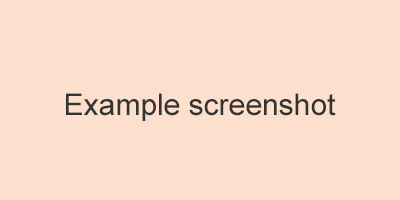

# test-logic

> The form data validation library.Does not contain UI.

[](https://travis-ci.org/onface/test-logic)
[](https://npmjs.org/package/test-logic)
[](https://npmjs.org/package/test-logic)

[](https://saucelabs.com/u/test-logic)

## Install

```shell
npm install test-logic --save
```

## Example

[](http://onface.github.io/test-logic/example)

## Online documentation

[Online](http://onface.github.io/test-logic)

## Change log

[CHANGELOG](./CHANGELOG.md)


## Maintainers

<table>
  <tbody>
    <tr>
    <td align="center">
      <a href="https://github.com/grifree"></a>
      <br>
      <a href="https://github.com/nimojs">Grifree</a>
    </td>
    <td align="center">
    <a href="https://github.com/nimojs"></a>
    <br>
    <a href="https://github.com/nimojs">NimoChu</a>
    </td>
    <tr>
  <tbody>
</table>
